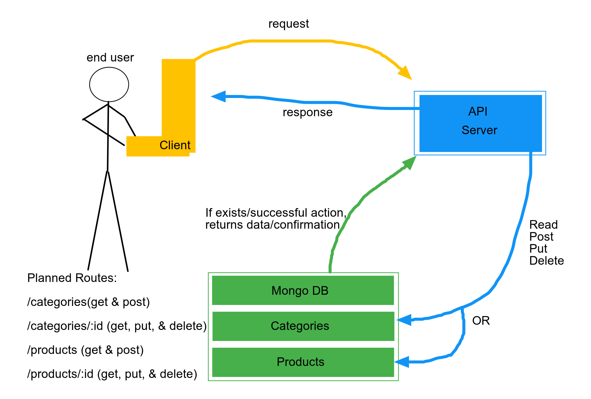

# API-Server
A learning project at CodeFellows, exploring HTTP and REST in servers.

### Author: David Palagashvili

- [submission PR]()
- [Swagger Hub]()

### Setup:

#### Environement Requirements:

PORT and MONGODB_ATLAS_URI="mongodb+srv://davidoffili:<password>@cluster0-zslz6.mongodb.net/<dbname>?retryWrites=true&w=majority"

#### Dependencies

"cf-supergoose": "^1.0.2",
"dotenv": "^8.2.0",
"express": "^4.17.1",
"jest": "^26.1.0",
"json-server": "^0.16.1",
"mongoose": "^5.9.20"

#### Testing Process

Tools used:
- jest
- cf-supergoose

#### Test Ran

To be continued...

#### Running our App

node index.js
nodemon index.js

#### UML

